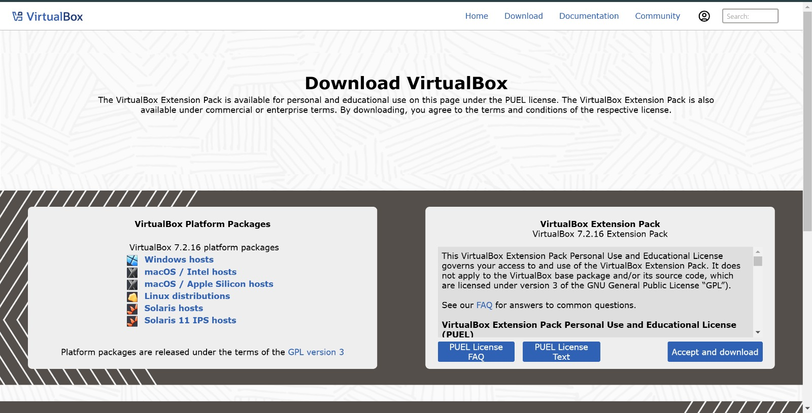
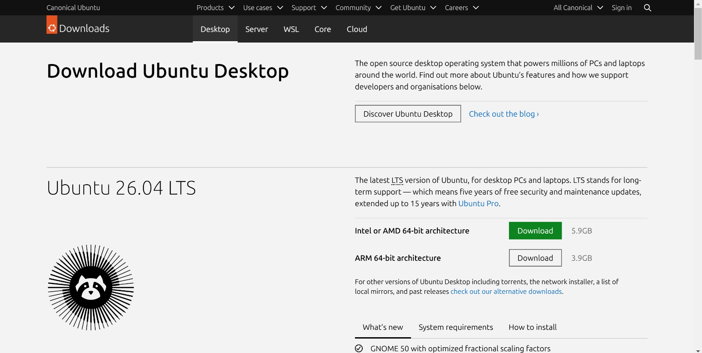
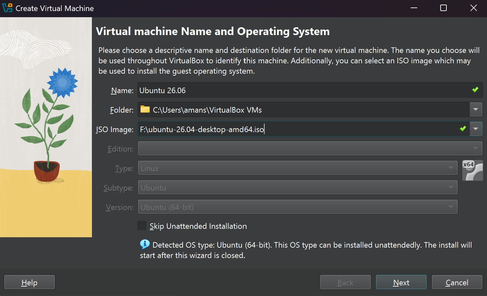
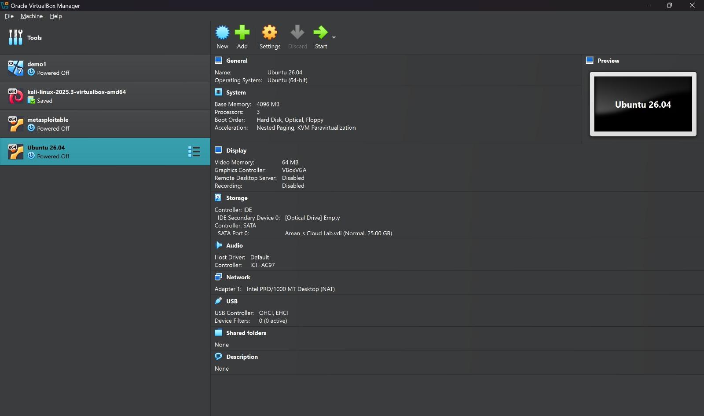
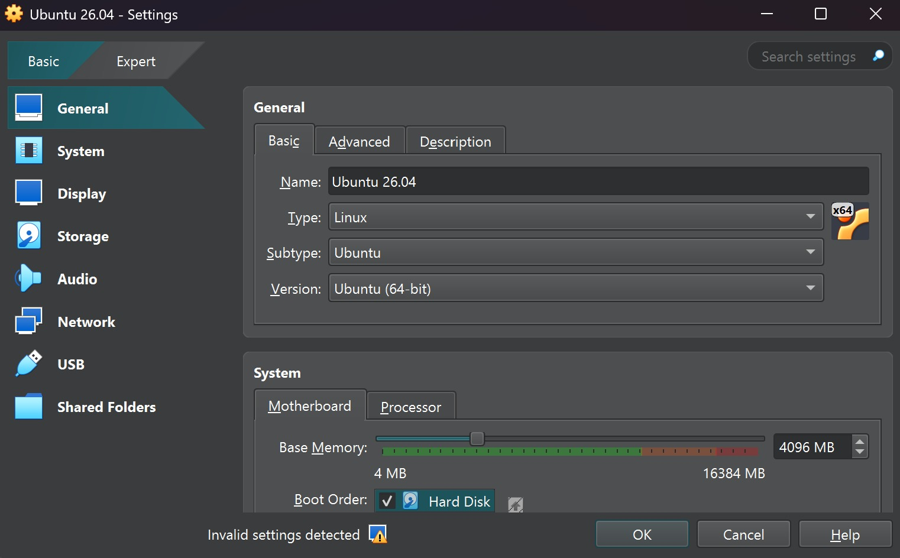
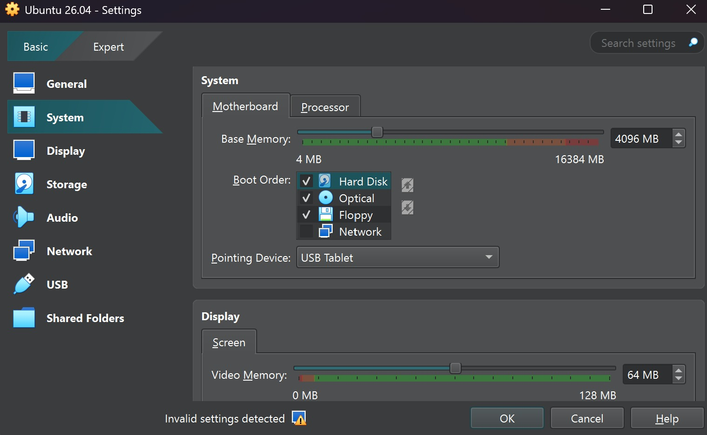
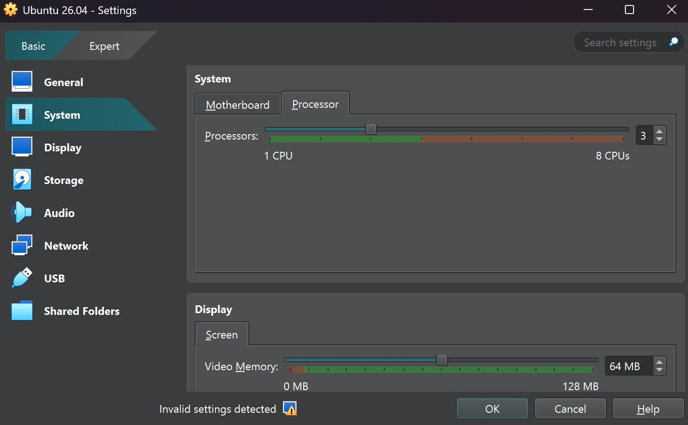
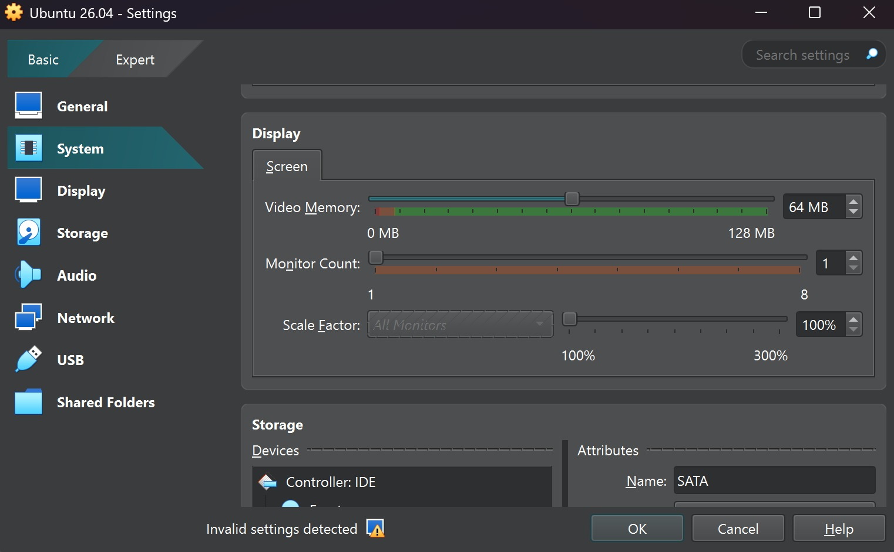
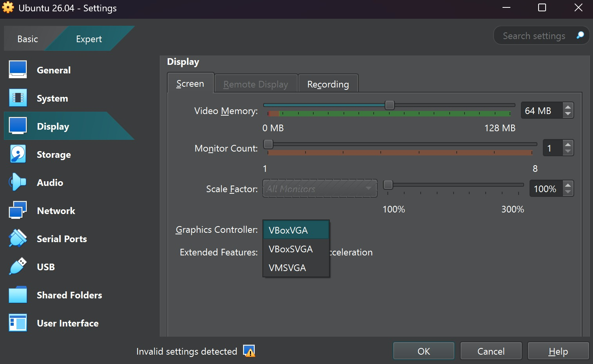

# Experiment 1 — Installation of Hypervisors and Initiation of VMs with Image File

## Aim

To install and configure an open-source hypervisor (Oracle VirtualBox) and to create, configure, and boot a Virtual Machine (VM) using an existing guest OS image file (Ubuntu ISO), thereby demonstrating successful installation and execution of the VM.

## Tasks Performed

- Installed an open-source hypervisor — Oracle VirtualBox.
- Obtained a suitable guest OS image (Ubuntu 26.04 LTS Desktop ISO).
- Created a new VM using the hypervisor.
- Configured the VM's CPU, RAM, storage, and network settings.
- Attached the ISO image to the VM and booted it.
- Completed the guest OS installation.
- Verified that the VM was running successfully.
- Installed `build-essential` and matching Linux kernel headers inside the VM.

## Procedure and Observations

### 1. Download and Install Oracle VirtualBox

The Oracle VirtualBox hypervisor (version 7.2.16) was downloaded from the official VirtualBox website, along with the matching Extension Pack, and installed on the host Windows machine.


*Fig 1.1 — Official VirtualBox download page showing platform packages and the Extension Pack.*

### 2. Obtain the Guest OS Image (Ubuntu ISO)

An Ubuntu 26.04 LTS Desktop ISO image (64-bit) was downloaded from the official Canonical Ubuntu website to be used as the installation media for the guest OS.


*Fig 2.1 — Canonical Ubuntu Downloads page for Ubuntu 26.04 LTS Desktop.*

### 3. Create a New Virtual Machine

A new VM named "Ubuntu 26.04" was created in VirtualBox. The downloaded ISO file was selected as the ISO Image so that VirtualBox could detect the OS type automatically. VirtualBox correctly identified it as an Ubuntu (64-bit) system, enabling unattended installation.


*Fig 3.1 — Create Virtual Machine wizard: VM name, folder, and ISO image selection.*

### 4. Verify VM Creation and Overview

Once created, the new "Ubuntu 26.04" VM appeared in the VirtualBox Manager list alongside other existing VMs. The overview pane confirmed the assigned resources: 4096 MB base memory, 3 processors, a 25 GB SATA virtual disk, and a NAT-based network adapter.


*Fig 4.1 — VirtualBox Manager showing the newly created Ubuntu 26.04 VM and its configuration summary.*

### 5. Configure General / System Settings

The VM's Settings window was opened to review the general configuration — name, OS type/subtype/version (Linux, Ubuntu, 64-bit) — and the base memory allocation of 4096 MB under System > Motherboard.


*Fig 5.1 — General settings confirming OS type as Linux / Ubuntu (64-bit).*

The boot order was configured with Hard Disk given priority, followed by Optical and Floppy, and the pointing device was set to USB Tablet for smoother mouse integration.


*Fig 5.2 — System > Motherboard tab showing base memory and boot order configuration.*

The number of virtual processors (CPUs) allocated to the VM was set to 3, well within the recommended range for the host machine.


*Fig 5.3 — System > Processor tab showing 3 CPUs allocated to the VM.*

### 6. Configure Display and Storage

Under the Display tab, video memory was set to 64 MB with a single monitor at 100% scale factor, and the Storage section shows the SATA controller with the attached virtual hard disk.


*Fig 6.1 — Display settings (video memory, monitor count) and Storage controller overview.*

In Expert mode, the Graphics Controller was reviewed, with VBoxVGA selected from the available options (VBoxVGA, VBoxSVGA, VMSVGA) for compatibility with the guest OS.


*Fig 6.2 — Expert mode Display settings showing Graphics Controller options.*

### 7. Boot the VM and Update Package Lists

After configuration, the VM was started and the Ubuntu guest OS booted successfully with the attached ISO. A terminal was opened on the guest desktop and `sudo apt update` was executed to refresh the package repository lists, confirming network connectivity and a working Ubuntu installation.


*Fig 7.1 — Terminal inside the running Ubuntu 26.04 VM after executing `sudo apt update`.*

### 8. Install Build Tools and Kernel Headers

The required build tools and matching Linux kernel headers were installed inside the guest VM using:

```bash
sudo apt update
sudo apt install -y build-essential linux-headers-$(uname -r)
```

The output confirmed that both packages were already the newest version, verifying a complete and up-to-date build environment.


*Fig 8.1 — `build-essential` and `linux-headers` installation/verification inside the VM.*

## Result / Conclusion

Oracle VirtualBox was successfully installed and configured on the host system. A new virtual machine was created, provisioned with appropriate CPU, RAM, storage, and network resources, and booted using the Ubuntu 26.04 LTS ISO image. The guest OS installation completed successfully, and the VM was verified to be running by executing package-management commands (`apt update` and installation of `build-essential` and `linux-headers`) from within the guest terminal. This confirms the successful setup and operation of a virtual machine using an open-source hypervisor.
